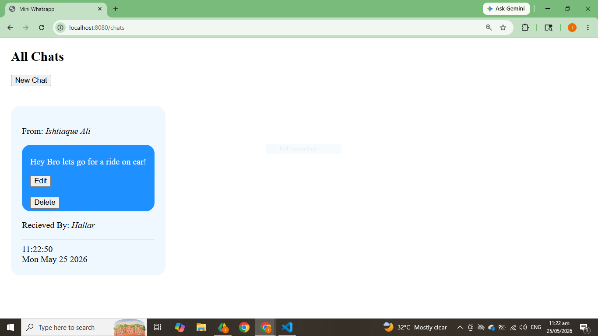

#  Chat App (Node.js + Express + MongoDB)

A simple and beginner-friendly **Chat Application** built using **Node.js, Express, MongoDB, and EJS**.  
This project demonstrates basic CRUD operations like creating, reading, updating, and deleting chat messages.

---

##  Features

- Create new chat messages
- View all chats
- Edit existing messages
- Delete chats with confirmation
- MongoDB database integration
- Server-side rendering using EJS
- Clean and simple UI
- Method override support for PUT & DELETE requests

---

##  Tech Stack

- Node.js
- Express.js
- MongoDB
- Mongoose
- EJS (Embedded JavaScript Templates)
- HTML, CSS, JavaScript
- Method-Override

---

## 📁 Project Structure

Chat App/
│
├── models/
│ └── chat.js
│
├── public/
│ ├── index.js (frontend JS)
│ └── style.css
│
├── views/
│ ├── index.ejs
│ ├── form.ejs
│ └── edit.ejs
│
├── index.js (main server file)
├── package.json
└── README.md


---

##  Installation & Setup

Follow these steps to run the project locally:

### 1️⃣ Clone the repository
```bash
git clone 
https://github.com/IshtiaqueDev/Mini-Chat_App.git

2️⃣ Move into project folder
cd chat-app
3️⃣ Install dependencies
npm install
4️⃣ Install required packages
npm install express mongoose ejs method-override
5️⃣ Start MongoDB

Make sure MongoDB is running locally:

mongodb://127.0.0.1:27017/whatsapp
6️⃣ Run the server
nodemon index.js

or

node index.js
🌐 Routes
Method	Route	Description
GET	/chats	Show all chats
GET	/chats/new	Form to create chat
POST	/chats	Create new chat
GET	/chats/:id/edit	Edit chat form
PUT	/chats/:id	Update chat
DELETE	/chats/:id	Delete chat
📸 Screenshots

Add your screenshots here


🏠 Home Page


🧠 What I Learned
How to build REST APIs using Express
MongoDB CRUD operations using Mongoose
Server-side rendering using EJS
Handling forms with PUT & DELETE methods
Using middleware like method-override
Basic frontend-backend integration
🔥 Future Improvements
Real-time chat using Socket.io
User authentication (login/signup)
Better UI with CSS framework (Bootstrap/Tailwind)
Message timestamps formatting
Profile-based chat system
👨‍💻 Author

Developed by Ishtiaq Ali
Learning Full Stack Web Development 🚀

⭐ If you like this project

Give it a ⭐ on GitHub and feel free to fork it!


---

If you want, I can also:
🔥 make it look like a **professional startup project README (level-up version)**  
🔥 or design **GitHub banner + screenshots layout for you**